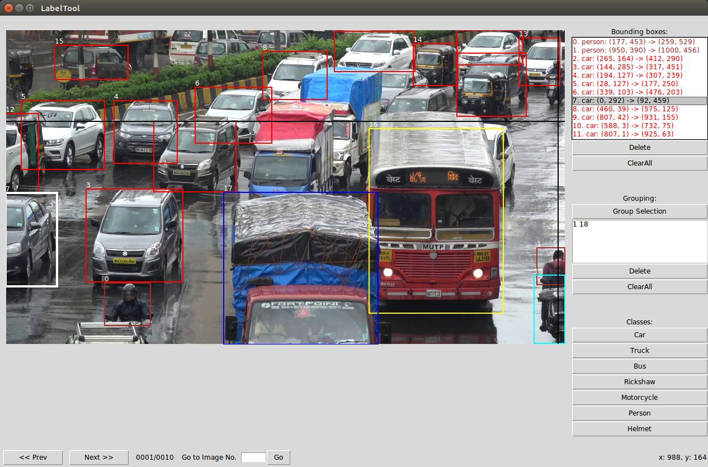

BBox-Label-Tool
===============

A simple tool for labeling object bounding boxes in images, implemented with Python Tkinter.

**Screenshot:**

Data Organization
-----------------
LabelTool  
|  
|--main.py   *# source code for the tool*  
|  
|--Images/   *# directory containing the images to be labeled*  
|  
|--Labels/   *# directory for the labeling results*   

Environment
----------
- python 3.5
- python PIL (Pillow)

Run
-------
$ python main.py

Usage
-----
0. The current tool requires that **the images to be labeled reside in /Images. You will need to modify the code if you want to label images elsewhere**.
1. How to draw a bounding box? 
   -First select a class from the buttons on the right, Eg. car, truck, bus, etc.
   -To create a new bounding box, left-click to select the first vertex. Moving the mouse to draw a rectangle, and left-click again to select the second vertex.
  - To cancel the bounding box while drawing, just press `<Esc>`.
  - To delete a existing bounding box, select it from the listbox, and click `Delete`.
  - To delete all existing bounding boxes in the image, simply click `ClearAll`.
2. How to create associations between motorcycle and riders.
  - Once all the bounding boxes have been drawn, have a look at the image. You can find the Id of motorcycles and persons. 
  - From the list of bouding boxes, select a motorcycles and the person(s) associated with it.
  - Then click **Group Selection** button to group the selected objects.
3. After finishing one image, click `Next` to advance. Likewise, click `Prev` to reverse. Or, input an image id and click `Go` to navigate to the speficied image.
  - **Be sure to click `Next` after finishing a image, or the result won't be saved**. 
